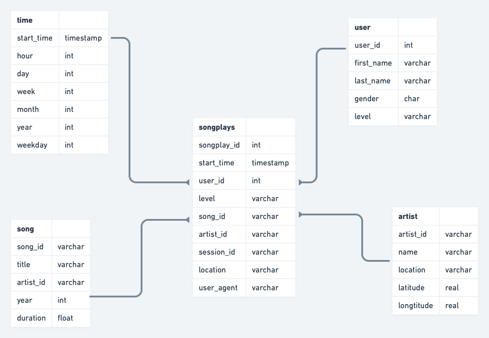

# Sparkify ETL pipeline
## Context
The scope of this ETL pipeline is to process log and song data provided by Sparkify and store in AWS Redshift for further analytics. The resulting tables will enable the analytics team to gather insights about the listing behaviour of the users.

This pipeline consists out of two main steps:
- Read both the log and song data provided as JSON files stored in S3 and write this log data to two staging tables.
- Transform the staged data into a star schema for further analytics.


## Process Steps


### Reading the log data from S3

First, we will connect to S3 to read the data provided by Sparkify. This consist out of both the log and song data stored as JSON files. We will save this information in 2 staging tables: STAGING_EVENTS & STAGING_SONGS

### Transform the data into a star-schema

Using an ETL script, we will transform the staged data into a star schema for further analytics.  The schema contains the following fact and dimension tables:




## Example queries:

This section will provide some example queries than can be run on the star schema:

```SQL
-- Count the amount of songs played by paid and free users for a given day
select s.level, count(*)
from songplays s
join time t on s.start_time = t.start_time
where t.year = 2018 and t.month = 11 and t.day = 2
group by s.level
```

```SQL
-- Display a list of unique songs played by a user
select distinct b.title, c.name
from songplays a
left join song b on a.song_id = b.song_id
join artist c on b.artist_id = c.artist_id
where user_id = 44
```

```SQL
-- Amount of artists in the song database
select count(*)
from artist
```

```sql
-- Amount of songs in the song database
select count(*)
from song
```

```SQL
-- Top 3 most streamed artists
select a.name, count(*) as number_of_plays
from songplays s
join artist a on s.artist_id = s.artist_id
group by a.name
order by 2 desc
limit 3
```


